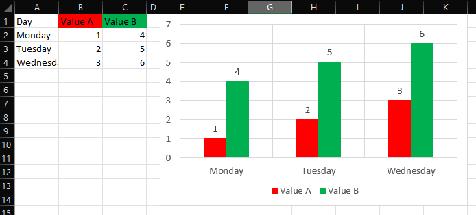

# Chart Colors from Data Source

## Description
Sets the colors of a chart based on the colors of the cells in its data source.



## Criteria
- A chart or an element inside a chart must be selected.
- The element selected determines which elements of the chart will be formatted, and which cells' formatting will be used.

| Selection           | Formatting Source    | Formatting Target |
| ------------------- | -------------------- | ----------------- | 
| Entire chart        | Legend (Series Name) | All Series        |
| Data Series         | Legend (Series Name) | One Series        |
| Data Point          | Value cell           | Data Point        |
| Category Axis       | Categories           | All Series        |
| Category Axis Title | Categories           | All Series        |
| Value Axis          | -                    | -                 |
| Value Axis Title    | -                    | -                 |
| Chart Title         | -                    | -                 |
| Data Labels         | -                    | -                 |
| Data Label          | -                    | -                 |
| Data Table          | -                    | -                 |
| Gridlines           | -                    | -                 |
| Legend              | Legend (Series Name) | All Series        |
| Legend Entry        | -                    | -                 |
| Plot Area           | -                    | -                 |


## Behaviour
- The tool will use the background color of the cell if it is not set to automatic. If it is, it will try to use the font color if it is not set to automatic. If both are set to automatic, it does nothing.
- If a cell is set to a constant, no formatting can be done.
- Colors will be applied to both Fill (bar/column charts) and Line (and Marker) formatting.
- The tool might not work with non-English localisations of Excel.
- The tool might not work with chart data sources that use constants which contain the list separator.

## Entry Point
```vb
ChartColorFromDataSource()
```