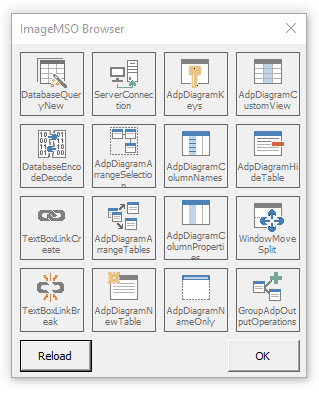

# ImageMSOViewer
Utility for rendering ImageMSO icons in Excel. This shows us the current rendition of the icon in the installed version, which differs over time from lists available on the internet.

The 4x4 grid of images to be loaded is from an Excel worksheet, therefore no changes are required to the VBA code.

Second worksheet has screenshots of some icons I found particularly useful.

## Screenshot

## My Standard Image List
[modStandardImageList.bas](modStandardImageList.bas) has my list of commonly used icons.