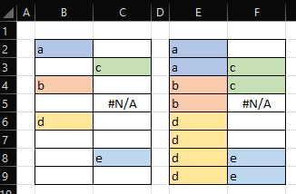

# Fill Down Into Empty

## Description
Fills all the empty cells in a column with the first non-empty column above them. 



Unlike the built-in Fill feature, this will only fill values into empty cells. It will not overwrite cells with existing data.

## Criteria
- The worksheet must be unprotected.
- The selection must span two or more rows.
- The selection may span one or more columns.
- The selection must not span an entire column nor an entire row.
- In the case of multiple selections (non-contiguous selections):
  - At least one selection must span two or more rows.
  - Remaining selections that span only one row will be ignored.
  - None of the selections must span an entire column or an entire row.
  
## Behaviour
- Any cells with formula will be converted to constants.
- All cells with errors will be ignored. They will not be overwritten and they will not be filled down.

## Entry Point
```vb
FillDownIntoEmpty()
```