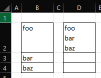

# Merge Cell Contents

## Description
Merges the contents of all cells in a selection upwards into the top-most cells, separating each cell's contents with a return line character. The contents of the cells below are then set to blank. 



Unlike the built-in Merge feature, this will preserve the contents of all the cells, rather than only keeping the upper-left value and discarding the rest.

## Criteria
- The worksheet must be unprotected.
- The selection must span two or more rows.
- The selection may span one or more columns.
- The selection must not span an entire column nor an entire row.
- In the case of multiple selections (non-contiguous selections):
  - At least one selection must span two or more rows.
  - Remaining selections that span only one row will be ignored.
  - None of the selections must span an entire column or an entire row.
  
## Behaviour
- Any cells with formula will be converted to constants.
- Cells containing errors will be converted into strings with their error code. e.g., `#NA` will be converted to the string `Error 2024` and `#NAME` will be converted to `Error 2029`.
- The actual structure of the cells (Merged/Unmerged) is not changed.
- Formatting and Row Heights are not changed.
- Multiple selections in the same column that do not overlap, e.g., `A1:A3` and `A10:A13` will merge into the top-most cell in each selection, i.e., `A1` and `A10`. They will not all merge into `A1` even though they are in the same column.

## Entry Point
```vb
MergeCellContents()
```