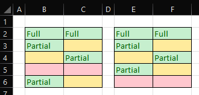

# Shift Up Non Empty

## Description
Shifts all the rows in a selection up, removing any empty rows.



As long as there is at least one cell with data, the row will be moved up. If all the cells in a row are blank, it will be removed.

## Criteria
- The worksheet must be unprotected.
- The selection must span two or more rows.
- The selection may span one or more columns.
- The selection must not span an entire column nor an entire row.
- In the case of multiple selections (non-contiguous selections):
  - At least one selection must span two or more rows.
  - Remaining selections that span only one row will be ignored.
  - None of the selections must span an entire column or an entire row.
  
## Behaviour
- Any cells with formula will be converted to constants.

## Entry Point
```vb
ShiftUpNonEmpty()
```